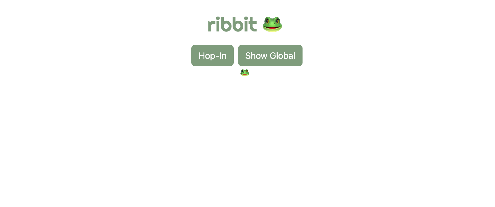
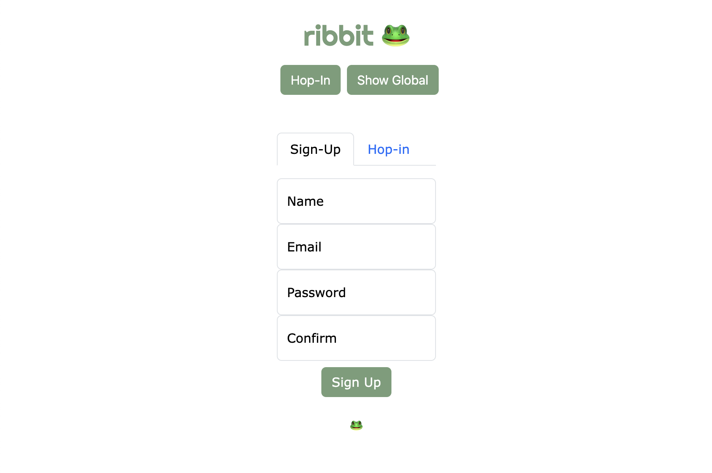
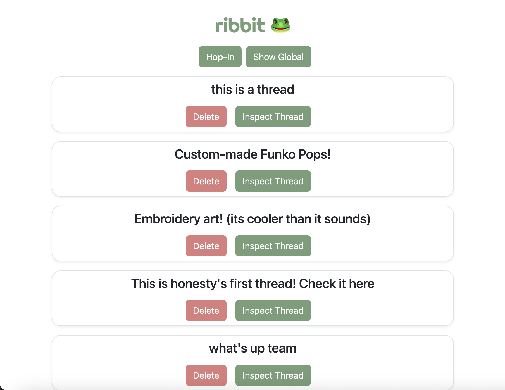
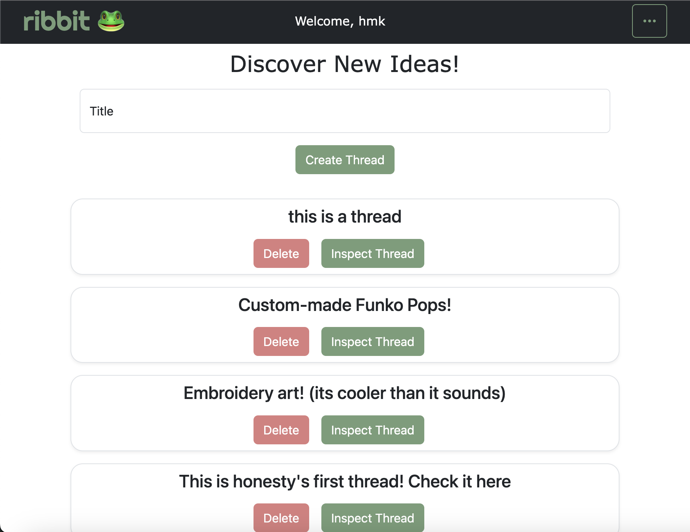
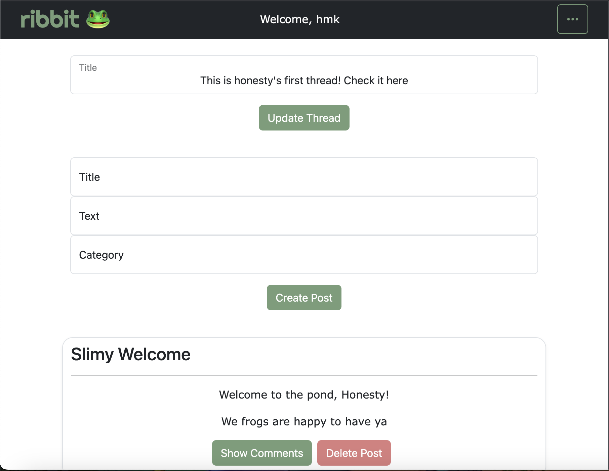
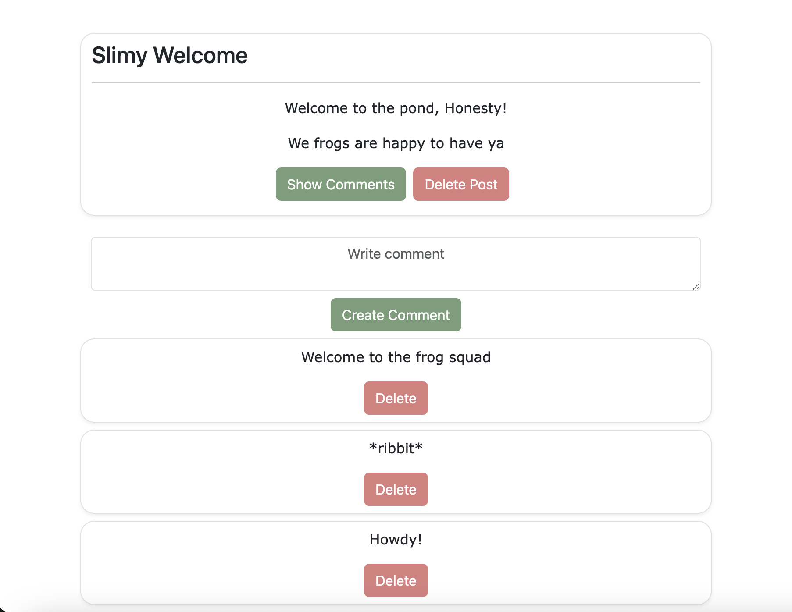

# Ribbit 🐸
Want to start a new hobby but not sure what? Already have a hobby, but want to know more? Try Ribbit!
Ribbit is a forum for hobbyists to use and explore, to share and learn, and to just have fun!
Users can create threads about a specific subject and then other users can create posts to branch off of them. 
And before you know it, you're having so much froggy fun!

## Technologies Used

- HTML5
- CSS3
- JavaScript
- Mongoose
- Express
- React
- Node.js
- Bootstrap
- MongoDB

## Getting Started

**Hop on over:** [Ribbit](https://npm-install-andand-npm-run-build-mnbj.onrender.com)

**The Process:** [Trello Board](https://trello.com/b/7G87qAfX/ribbit)

## Next Steps

### Version 2
- As the user, I want each thread, post, and comment to have the owner on it
- As the user, I want to be able to delete comments on my own post
- As the user, I want a search bar for hashtags
- As the user, I want modals for create posts and comments
- As the user, I want to pick the color of my thread when creating it
- As the user, I want to be able to like and dislike posts
- As the user, I want to be able to update my comments

### Version 3
- As the user, I want a default profile picture when my account is first made
- As the user, I want to be able to change my profile picture
- As the user, I want a dark mode
- As the user, I want a chat feature to DM other users
- As the user, I want a public access TV feature for each thread

---

## Our Team

**Erika Helm**

erikadphelm16@gmail.com

**Honesty Moore**

honestymoore77@gmail.com

**Heather Knapp**

heakna07@gmail.com

**Patrick Mangan**

pat.mangan@outlook.com